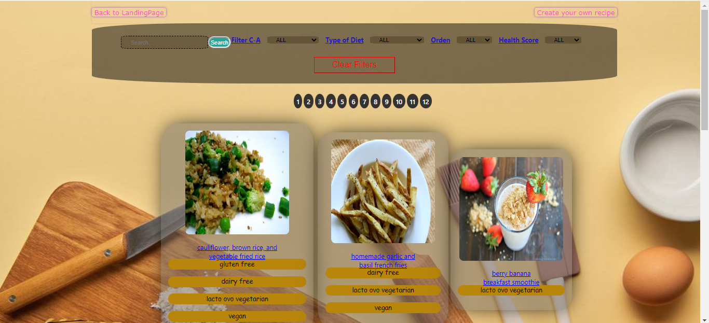
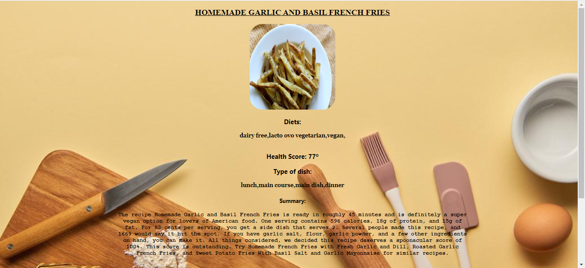
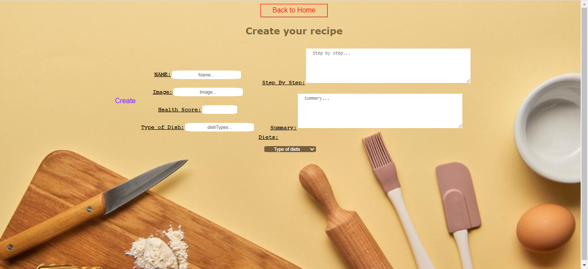
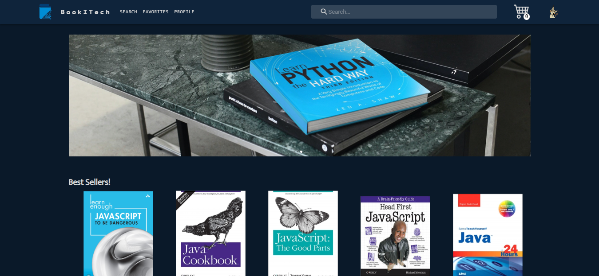
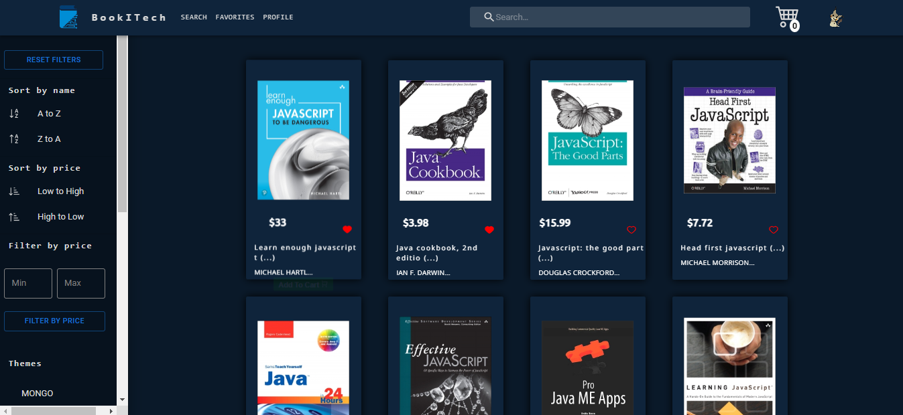
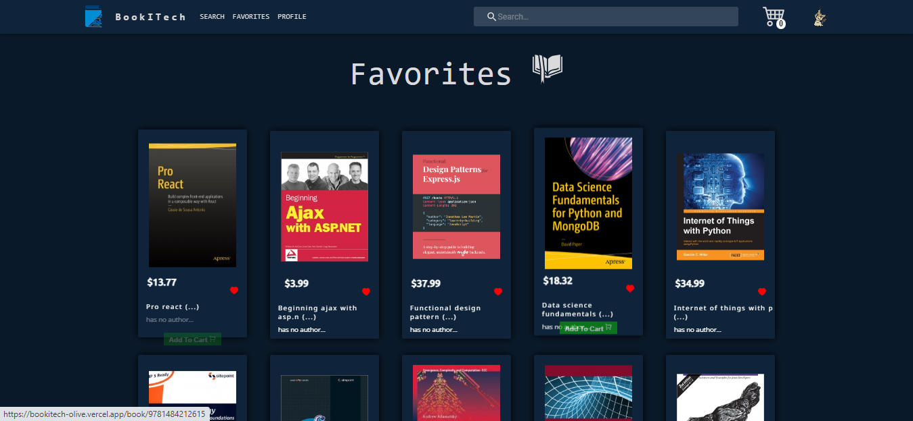
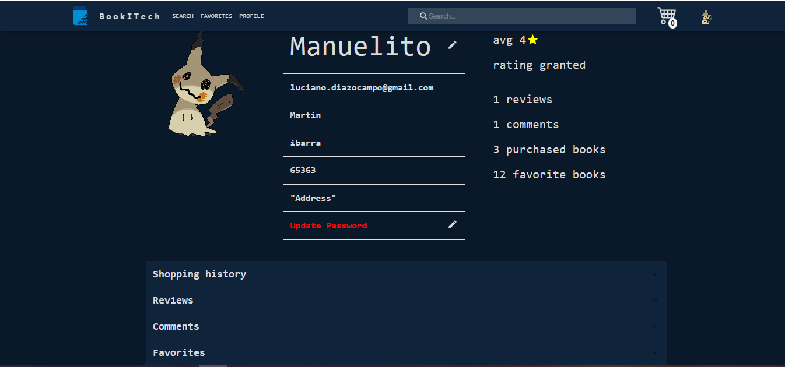
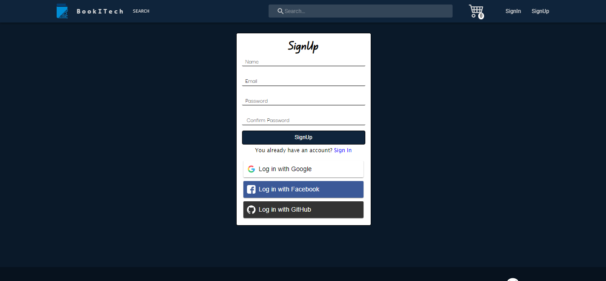
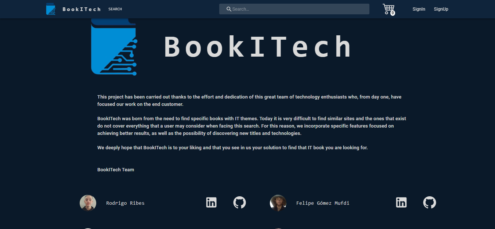

# Hola, Soy Luciano Diaz 👋

## Full Stack Developer 💻

### Soy una persona trabajadora enfocado en el proyecto, soy joven y con mucha energía para aprender y enseñar durante el proyecto. Haciendo proyectos personales para mejorar

---

## PROYECTOS:

---

### 🔸 FOOD APP

🚀 Tecnologías:
REACT - REDUX - JAVASCRIPT - CSS - NODE.JS - EXPRESS - POSTGRESQL

 

Repositorio:

---

<!-- ### 🔸 BOOKITECH - E-commerce

🚀 Tecnologías:
REACT - MATERIAL UI - REDUX TOOLKIT - JAVASCRIPT - FIREBASE - NODE.JS - MONGOOSE - EXPRESS - MONGO ATLAS -

 -->
<!--  -->

<!-- ### Grupos:

• Felipe:
 - 

• Rodrigo:
 - 

• Sergio:
 -

• Pablo:
 -

• Jorge:
 -

• Sebastian:
 -
 -->

<!--  
Repositorio:

--- -->

## Lenguajes y heramientas 🚀

• HTML 

• Javascript 

• CSS 

• React 

• Redux 

• Node.JS 

• Express 

• PostgreSQL 

• Sequelize 

• Git 

## Contactos 📩

**EMAIL:** luciano.diazocampo@gmail.com

